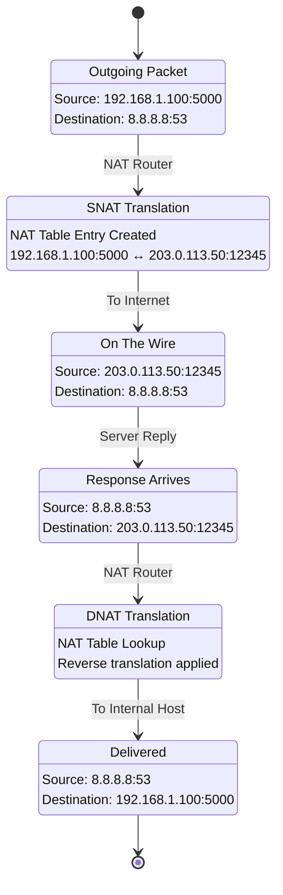

# 🔄 NAT (Network Address Translation)
## Visual Guide for Presentations

---

## 📌 Key Takeaways

- **NAT translates IPs:** Converts private IPs to public IPs, allowing multiple devices to share one public IP.
- **Three NAT types:** Static (1:1 mapping), Dynamic (pool of IPs), PAT/NAPT (many:1 using ports - most common).
- **SNAT vs DNAT:** SNAT modifies source IP (outbound); DNAT modifies destination IP (inbound/port forwarding).
- **Cloud NAT:** AWS NAT Gateway, Azure NAT Gateway, GCP Cloud NAT provide managed NAT services.
- **Command Tip:** Use `iptables -t nat -L` (Linux) to view NAT rules.

---

## 🎯 What is NAT?

**NAT = Translating Private IPs to Public IPs**

```
┌─────────────────────────────────────────────────────────────┐
│                    WITHOUT NAT                                │
│                                                              │
│  ┌──────────┐  ┌──────────┐  ┌──────────┐                │
│  │ Device 1 │  │ Device 2 │  │ Device 3 │                │
│  │192.168.1.5│  │192.168.1.6│  │192.168.1.7│                │
│  └────┬─────┘  └────┬─────┘  └────┬─────┘                │
│       │             │             │                        │
│       │ Direct connection to internet                     │
│       │             │             │                        │
│       └─────────────┼─────────────┘                        │
│                     │                                        │
│                     ▼                                        │
│            ┌──────────────┐                                  │
│            │   Internet   │                                  │
│            │              │                                  │
│            │  [!]  Each device needs public IP                │
│            │  [!]  Expensive                                  │
│            │  [!]  Security risk                              │
│            └──────────────┘                                  │
│                                                              │
│  [X] Not scalable                                             │
└─────────────────────────────────────────────────────────────┘

┌─────────────────────────────────────────────────────────────┐
│                    WITH NAT                                  │
│                                                              │
│  ┌──────────┐  ┌──────────┐  ┌──────────┐                │
│  │ Device 1 │  │ Device 2 │  │ Device 3 │                │
│  │192.168.1.5│  │192.168.1.6│  │192.168.1.7│                │
│  └────┬─────┘  └────┬─────┘  └────┬─────┘                │
│       │             │             │                        │
│       │             │             │                        │
│       └─────────────┼─────────────┘                        │
│                     │                                        │
│                     ▼                                        │
│            ┌──────────────┐                                  │
│            │   NAT        │                                  │
│            │   Router     │                                  │
│            │              │                                  │
│            │  Translates:                                    │
│            │  192.168.1.5 → 203.0.113.10:50001            │
│            │  192.168.1.6 → 203.0.113.10:50002            │
│            │  192.168.1.7 → 203.0.113.10:50003            │
│            └──────┬───────┘                                  │
│                   │                                          │
│                   │ Single public IP                         │
│                   │                                          │
│                   ▼                                          │
│            ┌──────────────┐                                  │
│            │   Internet   │                                  │
│            │              │                                  │
│            │  [+] One public IP for all                       │
│            │  [+] Cost-effective                              │
│            │  [+] Security (hides internal IPs)              │
│            └──────────────┘                                  │
│                                                              │
│  [+] Scalable and secure                                      │
└─────────────────────────────────────────────────────────────┘
```

---

## 🔄 NAT Types

### Static NAT

```
┌─────────────────────────────────────────────────────────────┐
│              STATIC NAT                                      │
│              (One-to-One Mapping)                             │
│                                                              │
│  ┌──────────────┐                                           │
│  │  Private IP  │                                           │
│  │  192.168.1.10│                                           │
│  └──────┬───────┘                                           │
│         │                                                    │
│         │ Always maps to                                    │
│         │                                                    │
│         ▼                                                    │
│  ┌──────────────┐                                           │
│  │  Public IP   │                                           │
│  │ 203.0.113.10 │                                           │
│  └──────┬───────┘                                           │
│         │                                                    │
│         │                                                    │
│         ▼                                                    │
│  ┌──────────────┐                                           │
│  │   Internet   │                                           │
│  └──────────────┘                                           │
│                                                              │
│  Characteristics:                                            │
│  [+] Permanent mapping                                        │
│  [+] One private IP = One public IP                          │
│  [+] Used for servers that need consistent public IP        │
│                                                              │
│  Use Cases:                                                  │
│  • Web servers                                               │
│  • Mail servers                                              │
│  • Servers that need inbound connections                    │
└─────────────────────────────────────────────────────────────┘
```

### Dynamic NAT

```
┌─────────────────────────────────────────────────────────────┐
│              DYNAMIC NAT                                     │
│              (Many-to-Many Mapping)                          │
│                                                              │
│  ┌──────────┐  ┌──────────┐  ┌──────────┐                  │
│  │ Device 1 │  │ Device 2 │  │ Device 3 │                  │
│  │192.168.1.5│  │192.168.1.6│  │192.168.1.7│                  │
│  └────┬─────┘  └────┬─────┘  └────┬─────┘                  │
│       │             │             │                          │
│       │             │             │                          │
│       └─────────────┼─────────────┘                          │
│                     │                                        │
│                     ▼                                        │
│            ┌──────────────┐                                  │
│            │   NAT Pool   │                                  │
│            │              │                                  │
│            │  Public IPs:                                    │
│            │  203.0.113.10                                   │
│            │  203.0.113.11                                   │
│            │  203.0.113.12                                   │
│            │              │                                  │
│            │  Assigns available IP                           │
│            └──────┬───────┘                                  │
│                   │                                          │
│                   │ Dynamic assignment                       │
│                   │                                          │
│                   ▼                                          │
│            ┌──────────────┐                                  │
│            │   Internet   │                                  │
│            └──────────────┘                                  │
│                                                              │
│  Characteristics:                                            │
│  [+] Temporary mapping                                        │
│  [+] Many private IPs share pool of public IPs               │
│  [+] IP released when connection ends                        │
│                                                              │
│  Use Cases:                                                  │
│  • Offices with many devices                                 │
│  • When you have limited public IPs                         │
└─────────────────────────────────────────────────────────────┘
```

### PAT (Port Address Translation) / NAT Overload

```
┌─────────────────────────────────────────────────────────────┐
│              PAT (NAT OVERLOAD)                              │
│              (Many-to-One with Ports)                         │
│                                                              │
│  ┌──────────┐  ┌──────────┐  ┌──────────┐                  │
│  │ Device 1 │  │ Device 2 │  │ Device 3 │                  │
│  │192.168.1.5│  │192.168.1.6│  │192.168.1.7│                  │
│  │:50000    │  │:50001    │  │:50002    │                  │
│  └────┬─────┘  └────┬─────┘  └────┬─────┘                  │
│       │             │             │                          │
│       │             │             │                          │
│       └─────────────┼─────────────┘                          │
│                     │                                        │
│                     ▼                                        │
│            ┌──────────────┐                                  │
│            │   PAT        │                                  │
│            │   Router     │                                  │
│            │              │                                  │
│            │  Translates:                                    │
│            │  192.168.1.5:50000 → 203.0.113.10:60001      │
│            │  192.168.1.6:50001 → 203.0.113.10:60002      │
│            │  192.168.1.7:50002 → 203.0.113.10:60003      │
│            │              │                                  │
│            │  Uses ports to differentiate                   │
│            └──────┬───────┘                                  │
│                   │                                          │
│                   │ Single public IP + different ports       │
│                   │                                          │
│                   ▼                                          │
│            ┌──────────────┐                                  │
│            │   Internet   │                                  │
│            └──────────────┘                                  │
│                                                              │
│  Characteristics:                                            │
│  [+] Many devices share ONE public IP                        │
│  [+] Uses port numbers to track connections                  │
│  [+] Most common type (home routers use this)                │
│                                                              │
└─────────────────────────────────────────────────────────────┘
```

### Mermaid Diagram: NAT Translation Flow



```
┌─────────────────────────────────────────────────────────────┐
│              PAT CONTINUED                                   │
│                                                              │
│  Use Cases:                                                  │
│  • Home networks                                             │
│  • Small offices                                             │
│  • Most common NAT type                                      │
└─────────────────────────────────────────────────────────────┘
```

---

## 🔄 NAT Flow: How It Works

### Outbound Connection (SNAT)

```
┌─────────────────────────────────────────────────────────────┐
│              SNAT FLOW (Source NAT)                          │
│              (Private → Public)                               │
│                                                              │
│  Step 1: Internal Device Makes Request                      │
│  ┌──────────┐                                              │
│  │ Device   │                                              │
│  │192.168.1.5│                                              │
│  │          │                                              │
│  │  Request: GET http://example.com                       │
│  │  Source: 192.168.1.5:50000                             │
│  │  Dest: example.com:80                                  │
│  └────┬─────┘                                              │
│       │                                                    │
│       │                                                    │
│       ▼                                                    │
│  Step 2: NAT Router Receives Packet                        │
│  ┌──────────────┐                                           │
│  │   NAT        │                                           │
│  │   Router     │                                           │
│  │              │                                           │
│  │  Creates NAT table entry:                               │
│  │  Private IP:Port → Public IP:Port                      │
│  │  192.168.1.5:50000 → 203.0.113.10:60001               │
│  └──────┬───────┘                                           │
│         │                                                    │
│         │ Translates source address                        │
│         │                                                    │
│         ▼                                                    │
│  Step 3: Packet Sent to Internet                           │
│  ┌──────────────┐                                           │
│  │   Internet   │                                           │
│  │              │                                           │
│  │  Packet:                                                │
│  │  Source: 203.0.113.10:60001                           │
│  │  Dest: example.com:80                                  │
│  └──────┬───────┘                                           │
│         │                                                    │
│         │                                                    │
│         ▼                                                    │
│  Step 4: Response Returns                                  │
│  ┌──────────────┐                                           │
│  │   Server     │                                           │
│  │              │                                           │
│  │  Response:                                              │
│  │  Source: example.com:80                                │
│  │  Dest: 203.0.113.10:60001                             │
│  └──────┬───────┘                                           │
│         │                                                    │
│         │                                                    │
│         ▼                                                    │
│  Step 5: NAT Router Translates Back                       │
│  ┌──────────────┐                                           │
│  │   NAT        │                                           │
│  │   Router     │                                           │
│  │              │                                           │
│  │  Looks up NAT table:                                    │
│  │  203.0.113.10:60001 → 192.168.1.5:50000               │
│  │                                                        │    │
│  │  Translates destination                                │    │
│  └──────┬───────┘                                           │
│         │                                                    │
│         │                                                    │
│         ▼                                                    │
│  ┌──────────┐                                              │
│  │ Device   │                                              │
│  │192.168.1.5│                                              │
│  │          │                                              │
│  │  Receives response                                      │
│  └──────────┘                                              │
│                                                              │
│  [+] NAT table maintains connection state                    │
│  [+] Return traffic automatically routed                    │
└─────────────────────────────────────────────────────────────┘
```

### Inbound Connection (DNAT)

```
┌─────────────────────────────────────────────────────────────┐
│              DNAT FLOW (Destination NAT)                     │
│              (Public → Private)                               │
│                                                              │
│  Step 1: External Request                                   │
│  ┌──────────┐                                              │
│  │ Internet │                                              │
│  │  Client  │                                              │
│  │          │                                              │
│  │  Request to: 203.0.113.10:80                           │
│  └────┬─────┘                                              │
│       │                                                    │
│       │                                                    │
│       ▼                                                    │
│  Step 2: NAT Router Receives                               │
│  ┌──────────────┐                                           │
│  │   NAT        │                                           │
│  │   Router     │                                           │
│  │              │                                           │
│  │  Port forwarding rule:                                  │
│  │  Public:Port → Private:Port                            │
│  │  203.0.113.10:80 → 192.168.1.10:80                     │
│  └──────┬───────┘                                           │
│         │                                                    │
│         │ Translates destination                            │
│         │                                                    │
│         ▼                                                    │
│  Step 3: Packet Forwarded to Internal                     │
│  ┌──────────┐                                              │
│  │  Server  │                                              │
│  │192.168.1.10│                                             │
│  │          │                                              │
│  │  Receives:                                              │
│  │  Dest: 192.168.1.10:80                                 │
│  └──────────┘                                              │
│                                                              │
│  [+] External clients can reach internal servers            │
│  [+] Port forwarding enables inbound connections            │
└─────────────────────────────────────────────────────────────┘
```

---

## 📊 NAT Comparison Table

```
┌──────────────────┬──────────────────┬──────────────────┬──────────────────┐
│ Feature          │ Static NAT       │ Dynamic NAT      │ PAT (Overload)   │
├──────────────────┼──────────────────┼──────────────────┼──────────────────┤
│ Mapping          │ 1:1              │ Many:Many        │ Many:1           │
│ Public IPs       │ One per device   │ Pool of IPs      │ Single IP        │
│ Port Usage       │ No               │ No               │ Yes              │
│ Scalability      │ Limited          │ Medium           │ High             │
│ Cost             │ High             │ Medium           │ Low              │
│ Use Case         │ Servers          │ Offices          │ Home/Small       │
│ Configuration    │ Manual           │ Automatic        │ Automatic        │
└──────────────────┴──────────────────┴──────────────────┴──────────────────┘
```

---

## ☁️ Cloud NAT Examples

### AWS NAT Gateway

```
┌─────────────────────────────────────────────────────────────┐
│              AWS NAT GATEWAY                                 │
│                                                              │
│  ┌────────────────────────────────────────────────────┐    │
│  │ Public Subnet                                     │    │
│  │ ────────────────────────────────────────────────    │    │
│  │                                                    │    │
│  │  ┌──────────────┐                                  │    │
│  │  │ NAT Gateway  │                                  │    │
│  │  │              │                                  │    │
│  │  │  Elastic IP: 203.0.113.10                     │    │
│  │  └──────┬───────┘                                  │    │
│  │         │                                            │    │
│  │         │                                            │    │
│  │         ▼                                            │    │
│  │  ┌──────────────┐                                  │    │
│  │  │ Internet     │                                  │    │
│  │  │ Gateway      │                                  │    │
│  │  └──────────────┘                                  │    │
│  └────────────────────────────────────────────────────┘    │
│                                                              │
│  ┌────────────────────────────────────────────────────┐    │
│  │ Private Subnet                                    │    │
│  │ ────────────────────────────────────────────────    │    │
│  │                                                    │    │
│  │  ┌──────────┐  ┌──────────┐  ┌──────────┐        │    │
│  │  │ EC2      │  │ EC2      │  │ RDS      │        │    │
│  │  │Instance  │  │Instance  │  │Database  │        │    │
│  │  │10.0.1.10 │  │10.0.1.11 │  │10.0.2.10 │        │    │
│  │  └────┬─────┘  └────┬─────┘  └──────────┘        │    │
│  │       │             │                            │    │
│  │       │ Route through NAT Gateway                │    │
│  │       │                                            │    │
│  │       └─────────────┘                              │    │
│  │                     │                              │    │
│  │                     ▼                              │    │
│  │            ┌──────────────┐                        │    │
│  │            │ NAT Gateway  │                        │    │
│  │            │ (in Public)  │                        │    │
│  │            └──────────────┘                        │    │
│  └────────────────────────────────────────────────────┘    │
│                                                              │
│  Route Table Configuration:                                 │
│  • Private subnet routes 0.0.0.0/0 → NAT Gateway          │
│  • NAT Gateway routes to Internet Gateway                  │
│                                                              │
│  [+] Managed service                                         │
│  [+] High availability                                       │
│  [+] Automatic scaling                                       │
└─────────────────────────────────────────────────────────────┘
```

### Azure NAT Gateway

```
┌─────────────────────────────────────────────────────────────┐
│              AZURE NAT GATEWAY                               │
│                                                              │
│  ┌────────────────────────────────────────────────────┐    │
│  │ Virtual Network                                   │    │
│  │ ────────────────────────────────────────────────    │    │
│  │                                                    │    │
│  │  ┌──────────┐  ┌──────────┐                      │    │
│  │  │ VM       │  │ VM       │                      │    │
│  │  │10.0.1.10 │  │10.0.1.11 │                      │    │
│  │  └────┬─────┘  └────┬─────┘                      │    │
│  │       │             │                            │    │
│  │       │             │                            │    │
│  │       └─────────────┘                            │    │
│  │                   │                                │    │
│  │                   ▼                                │    │
│  │          ┌──────────────┐                          │    │
│  │          │ NAT Gateway  │                          │    │
│  │          │              │                          │    │
│  │          │  Public IP: 203.0.113.10               │    │
│  │          └──────┬───────┘                          │    │
│  │                 │                                    │    │
│  │                 │                                    │    │
│  │                 ▼                                    │    │
│  │          ┌──────────────┐                          │    │
│  │          │   Internet   │                          │    │
│  │          └──────────────┘                          │    │
│  └────────────────────────────────────────────────────┘    │
│                                                              │
│  Features:                                                   │
│  [+] Managed NAT service                                     │
│  [+] Up to 64,000 concurrent flows                          │
│  [+] Zone-redundant                                          │
└─────────────────────────────────────────────────────────────┘
```

---

## 🎯 NAT Use Cases

### Home Network

```
┌─────────────────────────────────────────────────────────────┐
│              HOME NETWORK NAT                                │
│                                                              │
│  ┌──────────┐  ┌──────────┐  ┌──────────┐                  │
│  │ Laptop   │  │ Phone   │  │ Tablet   │                  │
│  │192.168.1.5│  │192.168.1.6│  │192.168.1.7│                  │
│  └────┬─────┘  └────┬─────┘  └────┬─────┘                  │
│       │             │             │                        │
│       │             │             │                        │
│       └─────────────┼─────────────┘                        │
│                     │                                        │
│                     ▼                                        │
│            ┌──────────────┐                                  │
│            │   Home       │                                  │
│            │   Router     │                                  │
│            │   (PAT)      │                                  │
│            │              │                                  │
│            │  Public IP: 203.0.113.45                      │
│            │  (from ISP)                                    │
│            └──────┬───────┘                                  │
│                   │                                          │
│                   │                                          │
│                   ▼                                          │
│            ┌──────────────┐                                  │
│            │   Internet   │                                  │
│            └──────────────┘                                  │
│                                                              │
│  [+] All devices share one public IP                         │
│  [+] Cost-effective                                          │
│  [+] Security (hides internal network)                       │
└─────────────────────────────────────────────────────────────┘
```

---

## 🔍 NAT Table Example

```
┌─────────────────────────────────────────────────────────────┐
│              NAT TRANSLATION TABLE                            │
│                                                              │
│  ┌────────────────────────────────────────────────────┐    │
│  │ Internal IP:Port    │ External IP:Port            │    │
│  ├────────────────────────────────────────────────────┤    │
│  │ 192.168.1.5:50000  │ 203.0.113.10:60001         │    │
│  │ 192.168.1.6:50001  │ 203.0.113.10:60002         │    │
│  │ 192.168.1.7:50002  │ 203.0.113.10:60003         │    │
│  │ 192.168.1.8:50003  │ 203.0.113.10:60004         │    │
│  │ 192.168.1.5:50004  │ 203.0.113.10:60005         │    │
│  └────────────────────────────────────────────────────┘    │
│                                                              │
│  How It Works:                                              │
│  1. Outbound: Maps private IP:port to public IP:port       │
│  2. Inbound: Looks up public IP:port, routes to private   │
│  3. Timeout: Entry removed after connection closes         │
│                                                              │
│  [+] Tracks all active connections                           │
│  [+] Enables return traffic routing                          │
└─────────────────────────────────────────────────────────────┘
```

---

## 📋 Prerequisites

Before starting this topic, you should understand:
- IP addressing and subnetting → [See IP Addressing Guide](../01-ip-addressing/)
- Private vs Public IP addresses
- TCP/IP basics → [See TCP/IP Guide](../02-tcp-ip/)
- Basic understanding of ports

---

## ⚠️ Common Mistakes

### Mistake 1: Confusing SNAT and DNAT
```
❌ Wrong: "SNAT is for incoming traffic"
✅ Correct: SNAT = Source NAT (outbound), DNAT = Destination NAT (inbound)
```

### Mistake 2: Forgetting NAT Table Limits
```
❌ Wrong: Assuming unlimited concurrent connections through NAT
✅ Correct: NAT tables have limits (typically 64K ports per public IP)
```

### Mistake 3: Port Forwarding Without Security
```
❌ Wrong: Port forward without firewall rules
✅ Correct: Always combine port forwarding with proper firewall rules
```

### Mistake 4: Using NAT Instead of Proper Routing
```
❌ Wrong: Using NAT between internal networks for "security"
✅ Correct: Use proper routing + firewalls; NAT adds complexity
```

---

## 🛠️ Command Reference

### Linux Commands (iptables)
```bash
# View NAT rules
iptables -t nat -L -n -v
iptables -t nat -L PREROUTING
iptables -t nat -L POSTROUTING

# SNAT (source NAT) - outbound
iptables -t nat -A POSTROUTING -o eth0 -j MASQUERADE
iptables -t nat -A POSTROUTING -s 192.168.1.0/24 -o eth0 -j SNAT --to-source 203.0.113.10

# DNAT (destination NAT) - port forwarding
iptables -t nat -A PREROUTING -i eth0 -p tcp --dport 80 -j DNAT --to-destination 192.168.1.10:80

# View connection tracking (NAT table)
cat /proc/net/nf_conntrack
conntrack -L
```

### AWS NAT Gateway
```bash
# Create NAT Gateway (AWS CLI)
aws ec2 create-nat-gateway \
  --subnet-id subnet-xxx \
  --allocation-id eipalloc-xxx

# Update route table for private subnet
aws ec2 create-route \
  --route-table-id rtb-xxx \
  --destination-cidr-block 0.0.0.0/0 \
  --nat-gateway-id nat-xxx
```

### Windows Commands
```powershell
# View NAT configuration
Get-NetNat
Get-NetNatStaticMapping

# Create NAT (PowerShell)
New-NetNat -Name "MyNAT" -InternalIPInterfaceAddressPrefix 192.168.1.0/24
```

---

## 📊 Quick Reference Card

```
NAT QUICK REFERENCE
===================

NAT Types:
  - Static NAT   - 1:1 mapping (servers, DMZ)
  - Dynamic NAT  - Pool of public IPs
  - PAT/NAPT     - Many:1 using ports (most common)

Direction:
  - SNAT - Source NAT (outbound traffic)
  - DNAT - Destination NAT (inbound/port forwarding)

Cloud NAT Services:
  - AWS: NAT Gateway (managed), NAT Instance
  - Azure: NAT Gateway, Load Balancer outbound rules
  - GCP: Cloud NAT

Key Concepts:
  - NAT Table - Tracks IP:port mappings
  - Port exhaustion - Max ~64K connections per public IP
  - Hairpin NAT - Internal traffic via NAT (avoid!)

Common Use Cases:
  - Private subnet -> Internet access
  - Port forwarding -> Expose internal services
  - IP masquerading -> Hide internal network
```

---

## 🎯 Key Takeaways for Presentations

1. **NAT = IP Translation** - Converts private IPs to public IPs
2. **Static NAT** - One-to-one permanent mapping
3. **Dynamic NAT** - Many-to-many temporary mapping
4. **PAT (Overload)** - Many-to-one using ports (most common)
5. **SNAT** - Source NAT (outbound traffic)
6. **DNAT** - Destination NAT (inbound traffic)
7. **NAT Table** - Tracks active translations
8. **Cloud NAT** - Managed NAT services (AWS, Azure, GCP)

---

## 🧠 Quick Quiz

<details>
<summary><strong>Q1:</strong> What does NAT stand for?</summary>

**Answer:** Network Address Translation

NAT translates private IP addresses to public IP addresses.
</details>

<details>
<summary><strong>Q2:</strong> What is PAT (Port Address Translation)?</summary>

**Answer:** Many-to-one NAT using port numbers

PAT allows multiple internal devices to share a single public IP by using unique port numbers.
</details>

<details>
<summary><strong>Q3:</strong> What is the difference between SNAT and DNAT?</summary>

**Answer:** SNAT modifies source IP (outbound); DNAT modifies destination IP (inbound)

SNAT is for outgoing traffic; DNAT is for port forwarding/incoming traffic.
</details>

<details>
<summary><strong>Q4:</strong> What AWS service provides managed NAT?</summary>

**Answer:** NAT Gateway

NAT Gateway is a managed, highly available NAT service for private subnet internet access.
</details>

---

## 📚 Further Reading

- NAT traversal techniques
- NAT64 (IPv6 to IPv4 translation)
- Carrier-grade NAT (CGNAT)
- NAT performance optimization

---

**Previous:** [TCP/IP & OSI Model](../02-tcp-ip/) | **Next:** [Routing & Routing Protocols](../04-routing/)
