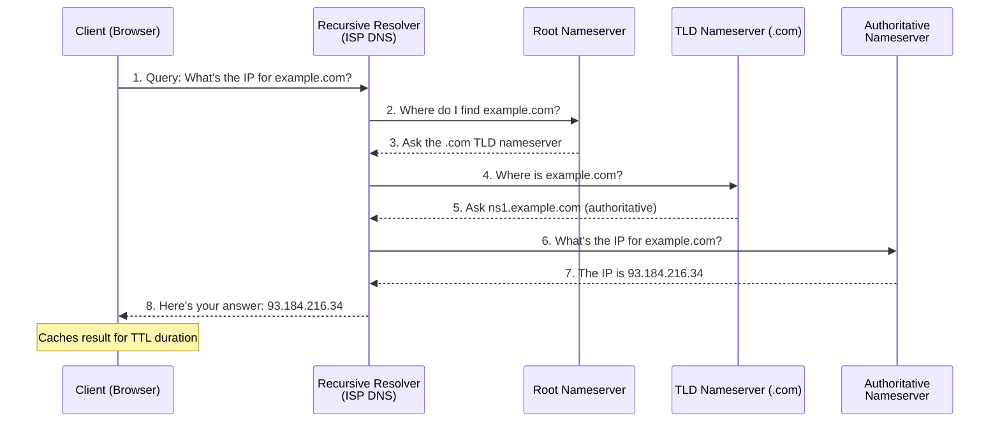

# 🌐 DNS (Domain Name System)
## Visual Guide for Presentations

---

## 📌 Key Takeaways

- **DNS = Internet's phonebook:** Translates human-readable domains (google.com) to IP addresses (142.250.185.46).
- **Hierarchical structure:** Root (.) → TLD (.com) → Domain (google.com) → Subdomain (www.google.com).
- **Caching speeds things up:** DNS results are cached at browser, OS, ISP, and resolver levels.
- **TTL controls freshness:** Time-To-Live determines how long records are cached before re-querying.
- **Command Tip:** Use `dig example.com` or `nslookup example.com` to query DNS records.

---

## 🎯 What is DNS?

**DNS = The Phonebook of the Internet**

```
┌─────────────────────────────────────────────────────────────┐
│                    WITHOUT DNS                               │
│                                                              │
│  You: "I want to visit Google"                              │
│  Browser: "What's the IP address?"                          │
│  You: "Umm... 142.250.185.46?" 🤔                          │
│                                                              │
│  [X] Hard to remember                                        │
│  [X] IPs change frequently                                    │
│  [X] Not user-friendly                                        │
└─────────────────────────────────────────────────────────────┘

┌─────────────────────────────────────────────────────────────┐
│                    WITH DNS                                  │
│                                                              │
│  You: "I want to visit google.com"                          │
│  DNS: "That's 142.250.185.46" [+]                            │
│  Browser: "Connecting..."                                    │
│                                                              │
│  [+] Easy to remember                                        │
│  [+] Human-friendly                                          │
│  [+] Automatic translation                                   │
└─────────────────────────────────────────────────────────────┘
```

---

## 🏗️ DNS Architecture: The Big Picture

```
┌─────────────────────────────────────────────────────────────┐
│                    DNS HIERARCHY                             │
│                                                              │
│                          . (Root)                           │
│                           │                                  │
│        ┌──────────────────┼──────────────────┐               │
│        │                  │                  │               │
│       .com               .org               .net            │
│        │                  │                  │               │
│    ┌───┴───┐          ┌───┴───┐          ┌───┴───┐         │
│    │       │          │       │          │       │         │
│  google  amazon     mozilla  linux    github  cloudflare   │
│    │       │          │       │          │       │         │
│   www    api        www     mail       www      cdn        │
│                                                              │
│  Each level manages its own domain space                    │
└─────────────────────────────────────────────────────────────┘
```

---

## 🔄 How DNS Resolution Works: Step by Step

### Visual Flow Diagram

```
┌─────────────────────────────────────────────────────────────┐
│              DNS RESOLUTION FLOW                             │
│                                                              │
│  Step 1: User Request                                       │
│  ┌──────────┐                                              │
│  │  User    │ Types: www.example.com                       │
│  │ Browser  │                                              │
│  └────┬─────┘                                              │
│       │                                                     │
│       ▼                                                     │
│  Step 2: Check Local Cache                                 │
│  ┌──────────┐                                              │
│  │  Local   │ "Do I know www.example.com?"                │
│  │  Cache   │                                              │
│  └────┬─────┘                                              │
│       │                                                     │
│       ├─ YES → Return IP (DONE!) [+]                        │
│       │                                                     │
│       └─ NO → Continue...                                   │
│       │                                                     │
│       ▼                                                     │
│  Step 3: Recursive Resolver                                │
│  ┌──────────┐                                              │
│  │Resolver  │ "I'll find it for you!"                     │
│  │(ISP DNS) │                                              │
│  └────┬─────┘                                              │
│       │                                                     │
│       ▼                                                     │
│  Step 4: Root Server Query                                 │
│  ┌──────────┐                                              │
│  │   Root   │ "Who knows .com?"                           │
│  │  Server  │ → "Ask .com nameservers"                    │
│  └────┬─────┘                                              │
│       │                                                     │
│       ▼                                                     │
│  Step 5: TLD Server Query                                  │
│  ┌──────────┐                                              │
│  │  .com    │ "Who knows example.com?"                    │
│  │  Server  │ → "Ask example.com nameservers"             │
│  └────┬─────┘                                              │
│       │                                                     │
│       ▼                                                     │
│  Step 6: Authoritative Server                              │
│  ┌──────────┐                                              │
│  │example.com│ "www.example.com = 93.184.216.34"         │
│  │Nameserver │                                              │
│  └────┬─────┘                                              │
│       │                                                     │
│       ▼                                                     │
│  Step 7: Return to User                                    │
│  ┌──────────┐                                              │
│  │  Browser │ Connects to 93.184.216.34                   │
│  │          │                                              │
│  │  [+] Cached for future use                              │
│  └──────────┘                                              │
└─────────────────────────────────────────────────────────────┘
```

### Mermaid Diagram: DNS Resolution Flow



### Detailed Visual Breakdown

```
┌─────────────────────────────────────────────────────────────┐
│  QUERY: www.example.com → IP Address?                       │
│                                                              │
│  ┌────────────────────────────────────────────────────┐    │
│  │ 1. Browser Cache Check                            │    │
│  │    "Have I seen www.example.com recently?"        │    │
│  │    [X] No → Continue                                │    │
│  └────────────────────────────────────────────────────┘    │
│                                                              │
│  ┌────────────────────────────────────────────────────┐    │
│  │ 2. OS Cache Check                                  │    │
│  │    "Does the OS know this?"                        │    │
│  │    [X] No → Continue                                │    │
│  └────────────────────────────────────────────────────┘    │
│                                                              │
│  ┌────────────────────────────────────────────────────┐    │
│  │ 3. Recursive Resolver (8.8.8.8)                   │    │
│  │    Checks its cache                                │    │
│  │    [X] No → Starts recursive query                  │    │
│  └────────────────────────────────────────────────────┘    │
│                                                              │
│  ┌────────────────────────────────────────────────────┐    │
│  │ 4. Root Server (.)                                  │    │
│  │    Query: "Where is .com?"                          │    │
│  │    Response: "Ask .com nameservers"               │    │
│  └────────────────────────────────────────────────────┘    │
│                                                              │
│  ┌────────────────────────────────────────────────────┐    │
│  │ 5. TLD Server (.com)                                │    │
│  │    Query: "Where is example.com?"                  │    │
│  │    Response: "Ask example.com nameservers"         │    │
│  └────────────────────────────────────────────────────┘    │
│                                                              │
│  ┌────────────────────────────────────────────────────┐    │
│  │ 6. Authoritative Server (example.com)              │    │
│  │    Query: "What is www.example.com?"               │    │
│  │    Response: "93.184.216.34" [+]                    │    │
│  └────────────────────────────────────────────────────┘    │
│                                                              │
│  ┌────────────────────────────────────────────────────┐    │
│  │ 7. Caching & Return                                │    │
│  │    • Resolver caches result                        │    │
│  │    • Browser caches result                         │    │
│  │    • Returns IP to browser                         │    │
│  └────────────────────────────────────────────────────┘    │
└─────────────────────────────────────────────────────────────┘
```

---

## 📋 DNS Record Types: Visual Guide

### Common DNS Records

```
┌─────────────────────────────────────────────────────────────┐
│                    DNS RECORD TYPES                          │
│                                                              │
│  ┌────────────────────────────────────────────────────┐    │
│  │ A Record (Address)                                 │    │
│  │ ────────────────────────────────────────────────    │    │
│  │  Maps: Domain → IPv4 Address                      │    │
│  │                                                    │    │
│  │  example.com          A    93.184.216.34         │    │
│  │  ────────────         ─    ───────────────         │    │
│  │  Domain               Type IPv4 Address           │    │
│  │                                                    │    │
│  │  Use: Basic website hosting                       │    │
│  └────────────────────────────────────────────────────┘    │
│                                                              │
│  ┌────────────────────────────────────────────────────┐    │
│  │ AAAA Record (IPv6 Address)                         │    │
│  │ ────────────────────────────────────────────────    │    │
│  │  Maps: Domain → IPv6 Address                      │    │
│  │                                                    │    │
│  │  example.com    AAAA    2606:2800:220:1:248:...  │    │
│  │                                                    │    │
│  │  Use: IPv6 support                                │    │
│  └────────────────────────────────────────────────────┘    │
│                                                              │
│  ┌────────────────────────────────────────────────────┐    │
│  │ CNAME Record (Canonical Name)                      │    │
│  │ ────────────────────────────────────────────────    │    │
│  │  Maps: Alias → Real Domain                        │    │
│  │                                                    │    │
│  │  www.example.com    CNAME    example.com         │    │
│  │  ───────────────    ──────    ───────────         │    │
│  │  Alias              Type      Real Domain         │    │
│  │                                                    │    │
│  │  Use: Multiple names for same server              │    │
│  └────────────────────────────────────────────────────┘    │
│                                                              │
│  ┌────────────────────────────────────────────────────┐    │
│  │ MX Record (Mail Exchange)                         │    │
│  │ ────────────────────────────────────────────────    │    │
│  │  Maps: Domain → Mail Server                       │    │
│  │                                                    │    │
│  │  example.com    MX    10    mail.example.com     │    │
│  │  ───────────    ──    ──    ────────────────     │    │
│  │  Domain         Type  Priority Mail Server        │    │
│  │                                                    │    │
│  │  Use: Email routing                               │    │
│  └────────────────────────────────────────────────────┘    │
│                                                              │
│  ┌────────────────────────────────────────────────────┐    │
│  │ NS Record (Name Server)                            │    │
│  │ ────────────────────────────────────────────────    │    │
│  │  Maps: Domain → DNS Servers                       │    │
│  │                                                    │    │
│  │  example.com    NS    ns1.example.com            │    │
│  │  example.com    NS    ns2.example.com            │    │
│  │                                                    │    │
│  │  Use: DNS delegation                              │    │
│  └────────────────────────────────────────────────────┘    │
│                                                              │
│  ┌────────────────────────────────────────────────────┐    │
│  │ TXT Record (Text)                                  │    │
│  │ ────────────────────────────────────────────────    │    │
│  │  Stores: Text data                                 │    │
│  │                                                    │    │
│  │  example.com    TXT    "v=spf1 mx ~all"          │    │
│  │  example.com    TXT    "google-site-verification" │    │
│  │                                                    │    │
│  │  Use: SPF, DKIM, domain verification             │    │
│  └────────────────────────────────────────────────────┘    │
└─────────────────────────────────────────────────────────────┘
```

---

## 🎯 Real-World DNS Scenarios

### Scenario 1: Simple Website

```
┌─────────────────────────────────────────────────────────────┐
│  SETUP: Single server hosting example.com                  │
│                                                              │
│  DNS Records:                                               │
│  ┌──────────────────────────────────────────┐             │
│  │ example.com          A    93.184.216.34 │             │
│  │ www.example.com      CNAME example.com   │             │
│  └──────────────────────────────────────────┘             │
│                                                              │
│  Visual Flow:                                               │
│                                                              │
│  User → www.example.com                                     │
│         │                                                    │
│         ├─ CNAME → example.com                              │
│         │                                                    │
│         └─ A → 93.184.216.34                                │
│                                                              │
│  Result: Both domains point to same IP                      │
└─────────────────────────────────────────────────────────────┘
```

### Scenario 2: Load Balanced Application

```
┌─────────────────────────────────────────────────────────────┐
│  SETUP: Multiple servers behind load balancer              │
│                                                              │
│  DNS Records:                                               │
│  ┌──────────────────────────────────────────┐             │
│  │ example.com    A    203.0.113.10         │             │
│  │ api.example.com A   203.0.113.20         │             │
│  │ cdn.example.com A   203.0.113.30         │             │
│  └──────────────────────────────────────────┘             │
│                                                              │
│  Visual Architecture:                                       │
│                                                              │
│         ┌──────────────┐                                    │
│         │example.com   │                                    │
│         │203.0.113.10  │                                    │
│         └──────┬───────┘                                    │
│                │                                            │
│         ┌──────▼───────┐                                    │
│         │ Load Balancer│                                    │
│         └──────┬───────┘                                    │
│                │                                            │
│    ┌───────────┼───────────┐                               │
│    │           │           │                               │
│  Server1    Server2    Server3                            │
│  10.0.1.10  10.0.1.11  10.0.1.12                          │
└─────────────────────────────────────────────────────────────┘
```

### Scenario 3: Multi-Region Deployment

```
┌─────────────────────────────────────────────────────────────┐
│  SETUP: Application deployed in multiple regions           │
│                                                              │
│  DNS Records (Geographic Routing):                          │
│  ┌──────────────────────────────────────────┐             │
│  │ US:    example.com → 203.0.113.10        │             │
│  │ EU:    example.com → 203.0.113.20        │             │
│  │ Asia:  example.com → 203.0.113.30        │             │
│  └──────────────────────────────────────────┘             │
│                                                              │
│  Visual Flow:                                               │
│                                                              │
│  User in US → example.com                                   │
│              │                                               │
│              └─ Route53 → US Server (203.0.113.10)         │
│                                                              │
│  User in EU → example.com                                   │
│              │                                               │
│              └─ Route53 → EU Server (203.0.113.20)            │
│                                                              │
│  [+] Lower latency                                           │
│  [+] Better performance                                      │
│  [+] Geographic distribution                                 │
└─────────────────────────────────────────────────────────────┘
```

---

## ⚡ DNS Caching: Performance Optimization

```
┌─────────────────────────────────────────────────────────────┐
│                    DNS CACHING LAYERS                       │
│                                                              │
│  ┌────────────────────────────────────────────────────┐    │
│  │ Layer 1: Browser Cache                              │    │
│  │ ────────────────────────────────────────────────    │    │
│  │  • TTL: Usually 60-300 seconds                      │    │
│  │  • Fastest lookup                                   │    │
│  │  • Cleared when browser closes                      │    │
│  └────────────────────────────────────────────────────┘    │
│                                                              │
│  ┌────────────────────────────────────────────────────┐    │
│  │ Layer 2: OS Cache (DNS Client)                    │    │
│  │ ────────────────────────────────────────────────    │    │
│  │  • TTL: Respects DNS record TTL                    │    │
│  │  • Shared across all applications                  │    │
│  │  • Windows: DNS Client Service                     │    │
│  │  • Linux: systemd-resolved                         │    │
│  └────────────────────────────────────────────────────┘    │
│                                                              │
│  ┌────────────────────────────────────────────────────┐    │
│  │ Layer 3: Recursive Resolver Cache                  │    │
│  │ ────────────────────────────────────────────────    │    │
│  │  • TTL: Respects DNS record TTL                    │    │
│  │  • Serves many users                               │    │
│  │  • Examples: 8.8.8.8, 1.1.1.1                     │    │
│  └────────────────────────────────────────────────────┘    │
│                                                              │
│  Cache Hit Flow:                                            │
│                                                              │
│  Request → Browser Cache → [+] Found (0ms)                  │
│                                                              │
│  Cache Miss Flow:                                           │
│                                                              │
│  Request → Browser Cache → [X]                              │
│          → OS Cache → [X]                                    │
│          → Resolver Cache → [X]                              │
│          → DNS Resolution → [+] (50-200ms)                  │
└─────────────────────────────────────────────────────────────┘
```

---

## 🛠️ DevOps Use Cases

### AWS Route53 Example

```
┌─────────────────────────────────────────────────────────────┐
│  AWS ROUTE53 DNS CONFIGURATION                              │
│                                                              │
│  Hosted Zone: example.com                                  │
│                                                              │
│  ┌────────────────────────────────────────────────────┐    │
│  │ Record Sets:                                       │    │
│  │                                                    │    │
│  │  Type    Name              Value                  │    │
│  │  ────    ──────────────    ────────────────────  │    │
│  │  A       example.com       ALB-123456789.us-...  │    │
│  │  A       www               example.com (alias)    │    │
│  │  A       api               203.0.113.10          │    │
│  │  CNAME   blog              blog.example.com      │    │
│  │  MX      example.com       10 mail.example.com   │    │
│  │  TXT     example.com       "v=spf1..."           │    │
│  └────────────────────────────────────────────────────┘    │
│                                                              │
│  Features:                                                  │
│  [+] Health checks                                           │
│  [+] Failover routing                                        │
│  [+] Geographic routing                                       │
│  [+] Weighted routing                                         │
│  [+] Latency-based routing                                    │
└─────────────────────────────────────────────────────────────┘
```

### Kubernetes DNS (CoreDNS)

```
┌─────────────────────────────────────────────────────────────┐
│  KUBERNETES DNS ARCHITECTURE                                │
│                                                              │
│  ┌────────────────────────────────────────────────────┐    │
│  │ Pod DNS Resolution:                               │    │
│  │                                                    │    │
│  │  myapp-service.default.svc.cluster.local         │    │
│  │  ──────  ────────  ───  ────────────────         │    │
│  │  Name    Namespace  svc  Cluster Domain          │    │
│  │                                                    │    │
│  │  Short form: myapp-service.default                │    │
│  └────────────────────────────────────────────────────┘    │
│                                                              │
│  ┌────────────────────────────────────────────────────┐    │
│  │ CoreDNS Configuration:                             │    │
│  │                                                    │    │
│  │  .:53 {                                            │    │
│  │      errors                                        │    │
│  │      health                                        │    │
│  │      kubernetes cluster.local in-addr.arpa ip6.arpa│    │
│  │      forward . /etc/resolv.conf                   │    │
│  │  }                                                 │    │
│  └────────────────────────────────────────────────────┘    │
│                                                              │
│  Service Discovery:                                         │
│                                                              │
│  Pod → myapp-service → CoreDNS → Service IP                │
│                                                              │
│  [+] Automatic service discovery                            │
│  [+] Load balancing via service                            │
│  [+] Namespace isolation                                   │
└─────────────────────────────────────────────────────────────┘
```

---

## 🔍 DNS Troubleshooting Commands

```
┌─────────────────────────────────────────────────────────────┐
│              DNS TROUBLESHOOTING TOOLS                       │
│                                                              │
│  ┌────────────────────────────────────────────────────┐    │
│  │ dig (Domain Information Groper)                    │    │
│  │ ────────────────────────────────────────────────    │    │
│  │                                                    │    │
│  │  $ dig example.com                                │    │
│  │  $ dig @8.8.8.8 example.com                      │    │
│  │  $ dig example.com MX                            │    │
│  │  $ dig example.com +trace                        │    │
│  │                                                    │    │
│  │  Shows: Query time, TTL, records                 │    │
│  └────────────────────────────────────────────────────┘    │
│                                                              │
│  ┌────────────────────────────────────────────────────┐    │
│  │ nslookup (Name Server Lookup)                      │    │
│  │ ────────────────────────────────────────────────    │    │
│  │                                                    │    │
│  │  $ nslookup example.com                           │    │
│  │  $ nslookup -type=MX example.com                  │    │
│  │                                                    │    │
│  │  Interactive mode available                        │    │
│  └────────────────────────────────────────────────────┘    │
│                                                              │
│  ┌────────────────────────────────────────────────────┐    │
│  │ host (Simple DNS lookup)                           │    │
│  │ ────────────────────────────────────────────────    │    │
│  │                                                    │    │
│  │  $ host example.com                                │    │
│  │  $ host -t MX example.com                         │    │
│  │                                                    │    │
│  │  Simple, human-readable output                     │    │
│  └────────────────────────────────────────────────────┘    │
│                                                              │
│  ┌────────────────────────────────────────────────────┐    │
│  │ whois (Domain Information)                         │    │
│  │ ────────────────────────────────────────────────    │    │
│  │                                                    │    │
│  │  $ whois example.com                               │    │
│  │                                                    │    │
│  │  Shows: Registrar, nameservers, registration info  │    │
│  └────────────────────────────────────────────────────┘    │
└─────────────────────────────────────────────────────────────┘
```

---

## 📊 DNS Performance Metrics

```
┌─────────────────────────────────────────────────────────────┐
│              DNS PERFORMANCE METRICS                         │
│                                                              │
│  Response Time:                                             │
│  ┌────────────────────────────────────────────────────┐    │
│  │  Excellent:  < 20ms                               │    │
│  │  Good:       20-50ms                               │    │
│  │  Acceptable: 50-100ms                              │    │
│  │  Slow:       > 100ms                                │    │
│  └────────────────────────────────────────────────────┘    │
│                                                              │
│  TTL (Time To Live):                                        │
│  ┌────────────────────────────────────────────────────┐    │
│  │  Short TTL (60s):   Frequent updates, more queries│    │
│  │  Medium TTL (300s): Balance of freshness/speed    │    │
│  │  Long TTL (3600s):  Fewer queries, slower updates │    │
│  └────────────────────────────────────────────────────┘    │
│                                                              │
│  Cache Hit Ratio:                                           │
│  ┌────────────────────────────────────────────────────┐    │
│  │  Target: > 80% cache hits                        │    │
│  │  Impact: Reduces load on DNS servers              │    │
│  └────────────────────────────────────────────────────┘    │
└─────────────────────────────────────────────────────────────┘
```

---

## 📋 Prerequisites

Before starting this topic, you should understand:
- IP addressing basics → [See IP Addressing Guide](../01-ip-addressing/)
- TCP/IP model (Application layer) → [See TCP/IP Guide](../02-tcp-ip/)
- Client-server concepts
- HTTP basics → [See HTTP/HTTPS Guide](../07-http-https/)

---

## ⚠️ Common Mistakes

### Mistake 1: Low TTL Causing High Query Load
```
❌ Wrong: TTL of 60 seconds for static content
✅ Correct: Use appropriate TTL: 60s for dynamic, 3600s+ for static content
```

### Mistake 2: Using CNAME at Zone Apex
```
❌ Wrong: CNAME for example.com (root domain)
✅ Correct: Use A/AAAA or ALIAS/ANAME records for root domain
```

### Mistake 3: Not Waiting for DNS Propagation
```
❌ Wrong: Expecting instant DNS changes globally
✅ Correct: Wait for TTL to expire; use dig to check specific nameservers
```

### Mistake 4: Incorrect MX Record Priority
```
❌ Wrong: Higher number = higher priority
✅ Correct: Lower number = higher priority (10 is preferred over 20)
```

---

## 🛠️ Command Reference

### dig (Recommended)
```bash
# Basic query
dig example.com

# Specific record type
dig example.com A
dig example.com AAAA
dig example.com MX
dig example.com NS
dig example.com TXT
dig example.com CNAME

# Query specific DNS server
dig @8.8.8.8 example.com

# Short output
dig +short example.com

# Trace DNS resolution
dig +trace example.com

# Reverse DNS lookup
dig -x 8.8.8.8

# All records
dig example.com ANY
```

### nslookup
```bash
# Basic lookup
nslookup example.com

# Specific DNS server
nslookup example.com 8.8.8.8

# Specific record type
nslookup -type=MX example.com
nslookup -type=TXT example.com
```

### host
```bash
# Basic lookup
host example.com

# Specific record type
host -t MX example.com
host -t NS example.com

# Reverse lookup
host 8.8.8.8
```

### Cloud DNS (AWS Route53)
```bash
# List hosted zones
aws route53 list-hosted-zones

# List records
aws route53 list-resource-record-sets --hosted-zone-id Z123456789

# Create record (via JSON file)
aws route53 change-resource-record-sets \
  --hosted-zone-id Z123456789 \
  --change-batch file://dns-change.json
```

---

## 📊 Quick Reference Card

```
DNS QUICK REFERENCE
===================

DNS Record Types:
  A      - IPv4 address
  AAAA   - IPv6 address
  CNAME  - Alias to another domain
  MX     - Mail server (with priority)
  NS     - Nameserver for zone
  TXT    - Text data (SPF, DKIM, verification)
  SOA    - Start of Authority (zone info)
  PTR    - Reverse DNS (IP -> domain)
  SRV    - Service location (port, priority)

DNS Hierarchy:
  . (root) -> .com (TLD) -> example.com -> www.example.com

TTL Guidelines:
  60-300s   - Dynamic content, frequent changes
  3600s     - Standard (1 hour)
  86400s    - Stable content (1 day)

Common DNS Servers:
  Google:     8.8.8.8, 8.8.4.4
  Cloudflare: 1.1.1.1, 1.0.0.1
  Quad9:      9.9.9.9

Troubleshooting Commands:
  dig +trace example.com     - Full resolution path
  dig @8.8.8.8 example.com   - Query specific server
  dig +short example.com     - Quick answer
```

---

## 🎯 Key Takeaways for Presentations

1. **DNS = Translation Service** - Converts domain names to IP addresses
2. **Hierarchical Structure** - Root → TLD → Domain → Subdomain
3. **Distributed System** - Millions of servers worldwide
4. **Caching is Critical** - Multiple cache layers improve performance
5. **Record Types Matter** - A, AAAA, CNAME, MX, NS, TXT serve different purposes
6. **DevOps Integration** - Essential for service discovery, load balancing, and routing

---

## 🧠 Quick Quiz

<details>
<summary><strong>Q1:</strong> What does DNS stand for?</summary>

**Answer:** Domain Name System

DNS translates human-readable domain names to IP addresses.
</details>

<details>
<summary><strong>Q2:</strong> What DNS record type maps a domain to an IPv4 address?</summary>

**Answer:** A record

AAAA is for IPv6, CNAME is for aliases, MX is for mail servers.
</details>

<details>
<summary><strong>Q3:</strong> What is the purpose of TTL in DNS?</summary>

**Answer:** Time-To-Live determines how long a DNS record is cached before re-querying.

Lower TTL = faster propagation but more queries; higher TTL = fewer queries but slower changes.
</details>

<details>
<summary><strong>Q4:</strong> What command traces the full DNS resolution path?</summary>

**Answer:** `dig +trace example.com`

This shows the query path from root servers through TLD to authoritative nameservers.
</details>

---

## 📚 Further Reading

- DNS Security (DNSSEC)
- DNS over HTTPS (DoH) / DNS over TLS (DoT)
- Anycast DNS
- DNS load balancing strategies

---

**Previous:** [HTTP/HTTPS](../07-http-https/) | **Next:** [Firewalls & Security Groups](../09-firewalls/)
